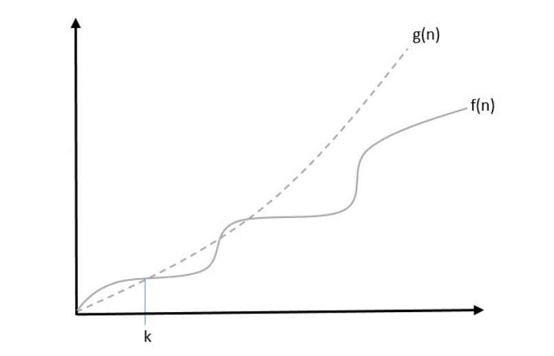
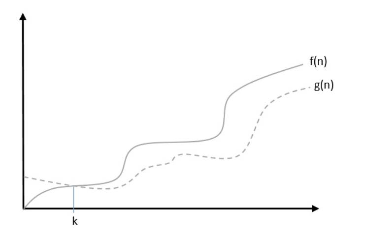

# Asymptotic Analysis
Asymptotic analysis of an algorithm refers to defining the mathematical foundation/framing of its run-time performance. Using asymptotic analysis, we can very well conclude the best case, average case, and worst case scenario of an algorithm.

Asymptotic analysis is input bound i.e., if there's no input to the algorithm, it is concluded to work in a constant time. Other than the "input" all other factors are considered constant.

Asymptotic analysis refers to computing the running time of any operation in mathematical units of computation. For example, the running time of one operation is computed as f(n) and may be for another operation it is computed as g(n2). This means the first operation running time will increase linearly with the increase in n and the running time of the second operation will increase exponentially when n increases. Similarly, the running time of both operations will be nearly the same if n is significantly small.

# Asymptotic Notations
Execution time of an algorithm depends on the instruction set, processor speed, disk I/O speed, etc. Hence, we estimate the efficiency of an algorithm asymptotically.

Time function of an algorithm is represented by T(n), where n is the input size.

Different types of asymptotic notations are used to represent the complexity of an algorithm. Following asymptotic notations are used to calculate the running time complexity of an algorithm.

- O − Big Oh Notation

- Ω − Big omega Notation

- θ − Big theta Notation

- o − Little Oh Notation

- ω − Little omega Notation

# Big Oh, O: Asymptotic Upper Bound
Big Oh, O: Asymptotic Upper Bound
The notation Ο(n) is the formal way to express the upper bound of an algorithm's running time. is the most commonly used notation. It measures the worst case time complexity or the longest amount of time an algorithm can possibly take to complete.

A function f(n) can be represented is the order of g(n) that is O(g(n)), if there exists a value of positive integer n as n0 and a positive constant c such that −

f(n)⩽c.g(n)
 for n>n0
 in all case

Hence, function g(n) is an upper bound for function f(n), as g(n) grows faster than f(n).

Example
Let us consider a given function, f(n)=4.n3+10.n2+5.n+1

Considering g(n)=n3
,

f(n)⩽5.g(n)
 for all the values of n>2

Hence, the complexity of f(n) can be represented as O(g(n))
, i.e. O(n3)

# Big Omega, Ω: Asymptotic Lower Bound
The notation Ω(n) is the formal way to express the lower bound of an algorithm's running time. It measures the best case time complexity or the best amount of time an algorithm can possibly take to complete.

We say that f(n)=Ω(g(n))
 when there exists constant c that f(n)⩾c.g(n)
 for all sufficiently large value of n. Here n is a positive integer. It means function g is a lower bound for function f ; after a certain value of n, f will never go below g.

Example
Let us consider a given function, f(n)=4.n3+10.n2+5.n+1
.

Considering g(n)=n3
, f(n)⩾4.g(n)
 for all the values of n>0
.

Hence, the complexity of f(n) can be represented as Ω(g(n))
, i.e. Ω(n3)

